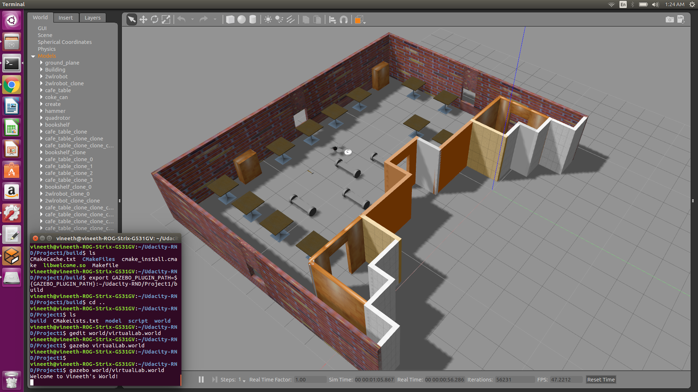

[](https://www.udacity.com/robotics)

# Udacity Nanodegree: Robotics Software Engineer

## Project 01: Build My World

### Directory Structure
```

.RoboND_Build_My_World          # Build My World main folder
├── model                       # Model files
│   ├── floorplan               # Created Building through Building Editor
│   │   ├── model.config
│   │   └── model.sdf
│   └── 2wlrobot                # Simple 2 wheel Robot 
│       ├── model.config
│       └── model.sdf
├── script                      # Gazebo World plugin C++ script
│   └── welcome.cpp
├── world                       # Gazebo main World containing models
│   └── virtualLab.world
├── CMakeLists.txt              # Link libraries
|-- BuildMyWorld.png            #contains the output image of the world
└── README.md            # README file for this Project 01: Build My World

```

### Output

