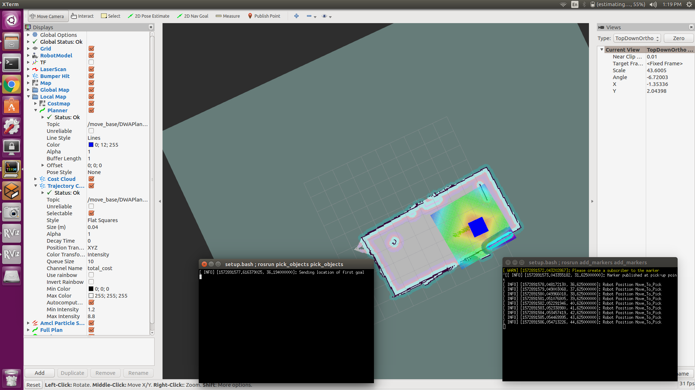
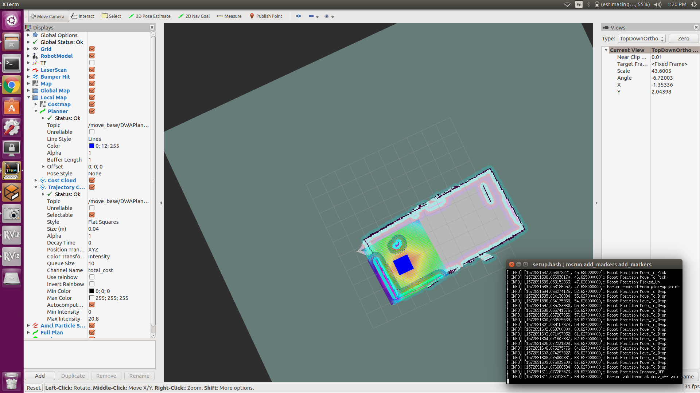

[](https://www.udacity.com/robotics)

# Udacity Nanodegree: Robotics Software Engineer

## Project 05: Home Service Robot 
Please refer "Writeup_HomeService.txt" inside the docs folder for more details on the project 

<p align="center">
    
    
</p> 

## Packages used in this project
This project uses the following ROS packages: turtlebot, turtlebot_simulator, turtlebot_interactions, slam_gmapping, move_base msgs, visualization_msgs 
2 Custom packages are created "add_markers", "pick_objects" 

### Directory Structure

```
.RoboND_Home_Service_Robot
└── catkin_ws/src 				#Project 05: Home Service Robot
    ├── add_markers                     #add_markers node 
    │   ├── CMakeLists.txt
    │   ├── include
    │   │   └── add_markers
    │   ├── package.xml
    │   └── src
    │       ├── add_markers.cpp
    │       └── add_markers_new.cpp
    ├── maps
    │   ├── Room_map.pgm
    │   └── Room_map.yaml
    ├── pick_objects                   #pick_objects node
    │   ├── CMakeLists.txt
    │   ├── include
    │   │   └── pick_objects
    │   ├── package.xml
    │   └── src
    │       └── pick_objects.cpp
    ├── rvizConfig
    │   └── room_map.rviz
    ├── scripts
    │   ├── add_markers.sh
    │   ├── home_service.sh
    │   ├── launch.sh
    │   ├── pick_objects.sh
    │   ├── test_navigation.sh
    │   └── test_slam.sh
    ├── slam_gmapping
    │   
    ├── turtlebot
    │   
    ├── turtlebot_interactions
    │   
    ├── turtlebot_simulator
    │  
    └── world
        ├── Room_new.world
        └── Wall_on.world
    .docs
     ├── r1.png
     ├── r2.png
     ├── Screenshot from 2019-11-04 13-19-27.png
     ├── Screenshot from 2019-11-04 13-19-54.png
     ├── Screenshot from 2019-11-04 13-20-01.png
     ├── Screenshot from 2019-11-04 13-20-08.png
     └── Writeup_HomeService.txt
```


### The program uses xterm to run the shell scripts
Install it using

```
sudo apt-get install xterm
```

### How to run

#### 1. First of all, clone this repo:
```
git clone --recursive https://github.com/kvsaivineeth/RoboND_Home_Service_Robot.git
```

#### 2. Build the directory within the catkin_ws dir
This can be done by launching ```catkin_make``` command:
```
$ cd RoboND_Home_Service_Robot/catkin_ws/
$ catkin_make
```

#### 3. Run the home_service.sh script from current dir (Give write permissions if necessary)
```
$ cd RoboND_Home_Service_Robot/catkin_ws/
$ source devel/setup.bash
$ ./src/scripts/home_service.sh
```

#### 4. Finally there are multiple xterminals opened on the screen
There is a Rviz screen which has the map of the environment alongwith the turtlebot navigating towards certain pre-defined positions to pick & place virtual objects inside the map. The object is represented with a blue square. 

